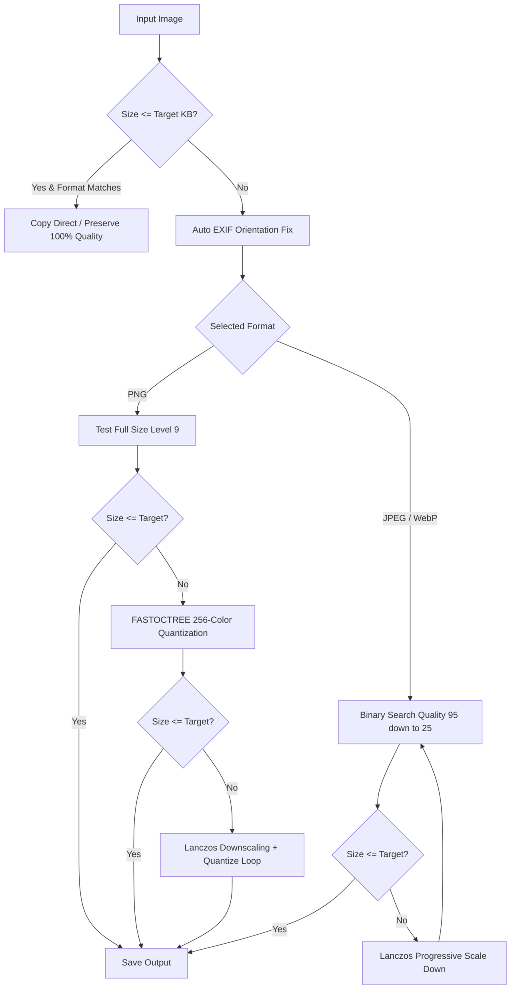

# Smart Image Compressor (`smart-image-compressor`)

[](https://www.python.org/)
[](LICENSE)
[]()
[](https://github.com/RabailAliBhatti/smart-image-compressor)
[]()

> **Fast, offline-first batch image compressor and modern utility dashboard.**  
> Effortlessly compress PNG, JPEG, WebP, and AVIF images strictly under **500 KB** (or any custom target size) for government portals, job applications, web performance, and document archiving—with zero visual degradation.

---

## 🌟 Why Smart Image Compressor?

Many government applications, university admissions, and job recruitment portals impose strict file size limits (such as **"under 500 KB"** or **"under 200 KB"**). Manually resizing photos, certificates, and ID cards with generic tools often blurs text or exceeds the upload ceiling.

**Smart Image Compressor** solves this completely:
- **Strict Size Guarantee**: Files are iteratively optimized to stay strictly below your exact target KB limit.
- **True Multi-Format Engine**:
  - **PNG**: Smart 256-color palette quantization (`FASTOCTREE`) and progressive Lanczos scaling that preserves **alpha transparency**.
  - **JPEG**: Precision binary-search quality optimization with high-resolution Lanczos downscaling.
  - **WebP & AVIF**: Next-generation compression for maximum size reduction.
  - **Auto**: Automatically preserves each file's native format (`.png` stays `.png`, `.jpg` stays `.jpg`).
- **100% Offline & Private**: Runs entirely on your local machine. No photos, scans, or identity documents are ever uploaded to cloud servers.
- **Dual Interface**: A clean, accessible **Web Dashboard** for non-technical users and a fast **CLI** for developers and power users.

---

## 🚀 Quick Start

### 1. Requirements
- Python 3.10 or higher
- Pillow (`PIL`):
  ```bash
  pip install Pillow
  ```

### 2. Launch the Visual Dashboard (Recommended)

#### On Windows:
Double-click [**`launch_dashboard.bat`**](file:///c:/Users/Rabail%20Ali/Desktop/Scripts/image-compressor/launch_dashboard.bat).  
*Your default web browser will automatically open with the dashboard at `http://localhost:5000`.*

#### On Any OS (macOS / Linux / Windows Terminal):
```bash
# Start the local server
python server.py

# Or run with the Python launcher on Windows:
py server.py
```

> **Standalone In-Browser Mode**: You can also double-click [**`index.html`**](file:///c:/Users/Rabail%20Ali/Desktop/Scripts/image-compressor/index.html) to run the dashboard directly in your browser with zero Python installation required.

---

## 🖥️ Dashboard Features

| Feature | Description |
| :--- | :--- |
| **Interactive Curtain Split Slider** | Draggable swipe curtain (like Squoosh/Juxtapose) for 100% pixel-level Before/After comparison, with Fit, 1x, 2x zoom and Side-by-Side toggle. |
| **Image-to-PDF Document Package** | Compile compressed images into a single multi-page PDF under strict size caps with customizable page margins and orientation. |
| **EXIF & GPS Privacy Stripper** | One-click toggle that strips camera serials, timestamps, and GPS coordinates before export. |
| **Folder Structure Preservation** | Drag whole folder hierarchies or use the "Browse Folder" button; folder paths are mirrored in the output batch ZIP. |
| **Batch File Renaming Rules** | Rename output files using customizable tags (`{name}`, `{ext}`, `{size}`, `{index}`, `{date}`) or quick presets (`{name}_min`, `{index}_{name}`, clean slug). |
| **Custom Watermark & Stamp** | Add branded text watermarks with position controls (center, corners) and adjustable opacity overlay. |
| **Drag & Drop & Clipboard** | Drop single images, folders, or paste directly from your clipboard (`Ctrl+V`). |
| **Numeric Target Size** | Direct number input (`[ 500 ] KB`) synchronized with precision slider and preset chips (`100 KB`, `250 KB`, `500 KB`, `1 MB`). |
| **Multi-Format Selection** | Switch between **Auto (Keep Original)**, **PNG**, **JPEG**, **WebP**, and **AVIF**. |
| **🔒 Protected Admin Portal** | Dedicated analytics console (`admin.html`) locked behind a master password with live SQLite audit logs and CSV export. |
| **PBKDF2 Password Security** | Change the admin master password directly within the portal, securely stored as a salted PBKDF2-HMAC-SHA256 hash. |
| **Brute-Force Rate Limiting** | Automatically locks out suspicious IPs for 15 minutes after 5 failed login attempts with HTTP 429 status. |
| **IP Blacklist & Access Control** | Block and unblock client IPs directly from the security modal. |
| **Date-Range Analytics Filtering** | Filter audit logs and KPI metrics by **All Time**, **Today**, **Last 7 Days**, or **Last 30 Days**. |

---

## 🔒 Admin Portal & Analytics Security

The Analytics & Activity Log screen is completely separated from the public compression tool and protected by enterprise-grade security:

- **Admin URL**: `http://localhost:5000/admin.html`
- **Default Master Password**: `admin123`
- **In-Portal Password Management**: Change the master password anytime from the admin header. Passwords are encrypted using **PBKDF2-HMAC-SHA256 with random 16-byte salt (100,000 rounds)** and stored in the SQLite `admin_config` table.
- **Brute-Force Rate Limiting**: After 5 failed password attempts from a client IP within a 15-minute window, the server automatically returns `HTTP 429 Too Many Requests` and locks login for 15 minutes.
- **IP Blacklisting**: Block offending or abusive client IPs from accessing the server.
- **Date-Range Telemetry**: View telemetry metrics and filter audit events across **All Time**, **Today**, **Last 7 Days**, and **Last 30 Days**.
- **Protected Endpoints**: `/api/analytics`, `/api/history`, `/api/export-history`, `/api/admin/change-password`, and `/api/admin/blacklist` strictly require valid admin session tokens. Anonymous attempts are blocked with `HTTP 401 Unauthorized`.

---

## 💻 Command Line Interface (CLI)

The CLI tool (`compress_images.py`) is modular, scriptable, and integrates directly with the SQLite database.

### Usage Examples

```powershell
# Default: Compresses all images in ./images to under 500 KB into ./compressed_images
py compress_images.py

# Strip EXIF metadata and stamp a watermark:
py compress_images.py -s 500 --watermark "CONFIDENTIAL"

# Compile all compressed images into a single multi-page PDF document:
py compress_images.py -i ./images -o ./compressed_images --pdf-out ./compressed_images/document.pdf

# Keep each file's original format (PNG -> PNG, JPG -> JPG):
py compress_images.py -f auto -s 500

# Force all output files to compressed PNG format:
py compress_images.py -f png -s 500

# Force all output files to ultra-compact WebP format:
py compress_images.py -f webp -s 300

# Specify custom input and output folders:
py compress_images.py -i "C:/Users/Documents/Scans" -o "C:/Users/Documents/Compressed" -s 200

# Overwrite files in-place:
py compress_images.py -i "path/to/folder" --in-place
```

### CLI Flags Reference

| Flag | Short | Default | Description |
| :--- | :---: | :---: | :--- |
| `--size` | `-s` | `500.0` | Target maximum file size in Kilobytes (KB). |
| `--format` | `-f` | `auto` | Target output format (`auto`, `png`, `jpeg`, `webp`). |
| `--input` | `-i` | `./images` | Input directory containing images to compress. |
| `--output` | `-o` | `./compressed_images` | Output directory where compressed files will be saved. |
| `--in-place` | - | `False` | Overwrite original images directly in-place. |
| `--keep-exif` | - | `False` | Preserve EXIF/GPS metadata (default strips EXIF for privacy). |
| `--watermark` | - | `""` | Optional text to watermark across compressed images. |
| `--pdf-out` | - | `None` | Compile all processed images into a single combined PDF document. |

---

## ⚙️ How the Compression Algorithm Works



1. **Orientation Correction**: Automatically transposes EXIF orientation tags so scanned certificates and phone photos are never rotated sideways or upside-down.
2. **Quality Binary Search**: For JPEG and WebP, performs a 6-step binary search across compression quality levels to find the highest visual quality that satisfies the target size.
3. **Adaptive Quantization**: For PNGs, applies FASTOCTREE color quantization (reducing 24-bit RGB to optimized 8-bit indexed palette while preserving full alpha transparency).
4. **Lanczos Resampling**: If maximum compression at native resolution still exceeds the size threshold (e.g. 35-megapixel camera photos), the image dimensions are downscaled smoothly using high-fidelity Lanczos filtering.

---

## 📂 Project Structure

```
smart-image-compressor/
├── .gitignore               # Security-tuned: excludes personal images & caches
├── LICENSE                  # MIT Open Source License
├── README.md                # Comprehensive documentation
├── app.js                   # Client-side canvas compressor & dashboard logic
├── compress_images.py       # Core Python compression engine & CLI
├── images/                  # Source images directory (.gitkeep tracked)
├── index.html               # Semantic, accessible web dashboard
├── launch_dashboard.bat     # 1-click Windows launcher for Web Dashboard
├── run_compressor.bat       # 1-click Windows launcher for CLI
├── server.py                # Zero-dependency local web server & batch API
└── styles.css               # Clean, high-contrast utility design system
```

---

## 🌐 Publishing to GitHub

To push this repository to your GitHub account:

```bash
# 1. Log in to GitHub (if not already authenticated)
gh auth login

# 2. Create the remote repository with the SEO-optimized name
gh repo create smart-image-compressor --public --source=. --remote=origin --push

# Or add your existing GitHub remote URL manually:
git remote add origin https://github.com/RabailAliBhatti/smart-image-compressor.git
git branch -M main
git push -u origin main --tags
```

---

## 📄 License

This project is licensed under the [MIT License](LICENSE) - see the [LICENSE](LICENSE) file for details.

Developed with precision by **Rabail Ali Bhatti** ([rabailalibhatti500@gmail.com](mailto:rabailalibhatti500@gmail.com)).
